# 投放全链路 · 思维导图

> 整合来源：CRIS 知识库《专题研修/06-信贷投放专题》（投放指标体系、四大渠道、预算与买量线、归因与回传、竞价机制、A/B 测试）+ 内部《投放运营现状梳理》《投放团队 × 模型团队 2026H2 项目合作清单》《模型团队OKR》+ 行业信息（Mintegral & Insightrackr 2026 趋势、Meta Advantage+ / Google PMax 自动化投放、增量测试实践）。
> 适用场景：信贷产品**新客获取链路**（付费投放、Referral 拉新、Cross-sell、产品漏斗承接）的投放体系建设。
>
> 用法：`## 一、总览` 为 **Mermaid 流程图，从左到右（LR）布局**，在 VS Code（Markdown Preview Mermaid Support 插件）/ Typora / mermaid.live 可渲染成横向树状脑图；`## 二、层级明细` 可直接导入幕布 / XMind（XMind 默认横向布局，天然从左到右）。
> 颜色标记：**🟩 绿色 = 正在做（现状，已在跑）；🟨 黄色 = 已规划、尚未开始（2026 H2 计划）；无色 = 未涉及**。对应关系见总览图下方的颜色说明。

---

## 一、总览（从左到右）

```mermaid
%%{init: {"flowchart": {"nodeSpacing": 40, "rankSpacing": 60, "padding": 5}}}%%
flowchart LR
    classDef doing fill:#c8e6c9,stroke:#2e7d32,stroke-width:2px,color:#1b5e20
    classDef planned fill:#fff3cd,stroke:#e6a700,stroke-width:2px,color:#7a5c00

    ROOT((投放全链路·新客获取))

    ROOT --> B1["① 经营目标"]
    B1 --> B11["北极星：CPS 稳定 × leads 增长 X%"]
    B1 --> B12["APP 规模与占比提升 X%"]
    B1 --> B13["新增渠道，拓展业务规模"]
    B1 --> B14["优质人群占比提升"]
    B1 --> B15["H2 衡量：NON SAAC ≥ 40% · 风险 7.1%"]
    B1 --> B16["现状：召回 / Cross-sell / Referral / 实验多线并行"]

    ROOT --> B2["② 数据与洞察"]
    B2 --> B21["投放行为数据（现状：Tracking 修复 / 归因进行中）"]
    B2 --> B22["归因基建（规划）"]
    B22 --> B221["统一 30 天窗口 / MMP 为准 / MTA 助攻"]
    B22 --> B222["iOS 双轨：IDFA 洞察 + SKAN 结算"]
    B2 --> B23["回传策略（规划）"]
    B23 --> B231["巧传：分层加权 / 前置 / 关键行为替代"]
    B23 --> B232["CAPI 深层事件 + 风险过滤回传"]
    B2 --> B24["三方数据与画像"]
    B24 --> B241["规划：银行流水抽取（O2-KR3）"]
    B24 --> B242["规划：画像 AI 智能体（O3-KR1）"]
    B2 --> B25["核心模型"]
    B25 --> B251["新客 PD 模型迭代（O2-KR1）"]
    B25 --> B252["Risk × Intent × Value 分层标准"]
    B25 --> B253["新客净 LTV / 买量线"]
    B25 --> B254["激活意愿 / Cross-sell Propensity"]

    ROOT --> B3["③ 人群分层与定向"]
    B3 --> B31["三维分层（规划）"]
    B31 --> B311["优质人群 → 保量提价"]
    B31 --> B312["常规人群 → 标准出价"]
    B31 --> B313["边缘人群 → 控价"]
    B31 --> B314["高风险人群 → 不投 / 素材劝退"]
    B3 --> B32["人群包定期刷新 + Lookalike（规划）"]
    B3 --> B33["渠道 × 人群 × 出价匹配（规划）"]
    B3 --> B34["存量人群挖掘（现状）"]
    B34 --> B341["注册未申请 / Bounce 召回（3.2k → 2 Loans）"]
    B34 --> B342["沉默激活（13.6k → 约 30 Leads）"]
    B34 --> B343["Cross-sell Fundo→WageGo（5.1k 验证）"]
    B3 --> B35["优质人群识别：画像月度洞察（规划）"]

    ROOT --> B4["④ 渠道与阵地"]
    B4 --> B41["现有付费渠道（现状）"]
    B41 --> B411["Google：需求拦截"]
    B41 --> B412["Meta：人群圈选 / Advantage+"]
    B41 --> B413["TikTok：兴趣引爆"]
    B41 --> B414["应用商店：高质量流量"]
    B4 --> B42["Referral 老带新（现状亮点）"]
    B42 --> B421["5,699 发送 → 2,453 推荐（43%）→ 71 放款"]
    B42 --> B422["痛点：数据质量 + 合规限制"]
    B42 --> B423["规划：关系治理 + 合规突破 → 放量"]
    B4 --> B43["新增渠道（规划）"]
    B43 --> B431["小预算测试 → 评估 → 放量框架"]
    B43 --> B432["渠道评分卡：量 / 成本 / 质量 / 合规"]
    B4 --> B44["Web → APP"]
    B44 --> B441["现状：Routing / Returning 实验"]
    B44 --> B442["规划：漏斗分析 + 激活意愿人群"]

    ROOT --> B5["⑤ 素材创意"]
    B5 --> B51["素材即风控：决定「谁来」（现状）"]
    B5 --> B52["公式：场景切入 + 流程展示 + 信任背书"]
    B5 --> B53["合规红线：禁「保证通过」/ 利率透明（现状）"]
    B5 --> B54["素材衰减监控：CTR 降 1.5% 触发迭代（规划）"]
    B5 --> B55["AI 赋能素材生产（行业趋势 2026）"]

    ROOT --> B6["⑥ 出价与预算"]
    B6 --> B61["预算分配 + 出价策略（现状：人工主导）"]
    B6 --> B62["买量线 = 净LTV × 利润率系数（规划）"]
    B6 --> B63["三条线：盈亏平衡 / 目标ROI / 止损（规划）"]
    B6 --> B64["边际 CPS：扩量 / 止损决策（规划）"]
    B6 --> B65["预算节奏四阶段（知识库）"]
    B6 --> B66["学习期管理：约 50 转化（知识库）"]

    ROOT --> B7["⑦ 转化漏斗与产品承接"]
    B7 --> B71["曝光 → 点击 → 下载 → 注册 → 申请 → 授信 → 放款（现状）"]
    B7 --> B72["产品漏斗实验（现状）"]
    B72 --> B721["OB / Fiskil：完成率 67% → 74%"]
    B72 --> B722["Default Amount 2850：金额影响显著 / 转化分化"]
    B72 --> B723["Routing / Returning / Authority：部分关闭"]
    B7 --> B73["金额分层雏形：老客 2850 / 新客 2050（现状）"]
    B7 --> B74["权益承接：Cashback 待放量 / Risk Pricing 空跑（现状）"]
    B7 --> B75["漏斗评估看完整链路 Exposure→Revenue（规划）"]

    ROOT --> B8["⑧ 风控协同"]
    B8 --> B81["新客 PD 迭代：头尾区分度（O2-KR1）"]
    B8 --> B82["渠道 × 素材 × 人群 FPD / 通过率监控"]
    B8 --> B83["素材级风险预警与下线"]
    B8 --> B84["回传人群风险过滤"]
    B8 --> B85["RTA 实时前置筛选（远期评估）"]

    ROOT --> B9["⑨ 指标体系"]
    B9 --> B91["前端：CPM / CTR / CPC / CPI / CPS（现状）"]
    B9 --> B92["后端：ROI / LTV / CAC / 回本周期（规划）"]
    B9 --> B93["风险：通过率 / FPD / NPL / 复借率（规划）"]
    B9 --> B94["经营：边际获客成本 / 渠道集中度（规划）"]
    B9 --> B95["AB 实验（现状：大量并行、成功率一般）"]
    B95 --> B951["规范：单变量 / 显著性 / 后端优先（规划）"]
    B9 --> B96["增量测试 Geo-lift / Holdout（规划）"]
    B9 --> B97["投放监控 Agent（规划）"]

    ROOT --> B10["⑩ 组织与闭环"]
    B10 --> B101["现状：投放 × 运营 × 风控多方协作"]
    B10 --> B102["投放-模型-风控协同闭环（O5-KR2）"]
    B10 --> B103["闭环：归因 → 回传 → 算法优化 → 预算迭代"]
    B10 --> B104["趋势：媒体自动化 → 优化师转型策略师"]
    B10 --> B105["合规：平台政策 + 监管要求（现状）"]

    class B1,B16,B2,B21,B3,B34,B341,B342,B343,B4,B41,B411,B412,B413,B414,B42,B421,B422,B44,B441,B5,B51,B53,B6,B61,B7,B71,B72,B721,B722,B723,B73,B74,B9,B91,B95,B10,B101,B105 doing
    class B11,B12,B13,B14,B15,B22,B221,B222,B23,B231,B232,B24,B241,B242,B25,B251,B252,B253,B254,B31,B311,B312,B313,B314,B32,B33,B35,B423,B43,B431,B432,B442,B54,B55,B62,B63,B64,B75,B8,B81,B82,B83,B84,B85,B92,B93,B94,B951,B96,B97,B102,B103,B104 planned

    LEG1["■ 绿色 = 正在做（现状，已在跑）"]:::doing
    LEG2["■ 黄色 = 已规划，尚未开始（2026 H2）"]:::planned
    LEG3["□ 无色 = 未涉及 / 暂无计划"]
```

---

### 颜色说明：正在做 vs 已规划未开始

| 颜色    | 含义                                  | 对应工作                                                                                                                                                                                                                                                                                                                                                                                                                                                                                                            |
| ------- | ------------------------------------- | ------------------------------------------------------------------------------------------------------------------------------------------------------------------------------------------------------------------------------------------------------------------------------------------------------------------------------------------------------------------------------------------------------------------------------------------------------------------------------------------------------------------- |
| 🟩 绿   | **正在做（现状，已在跑）**      | 现有付费渠道投放（Google / Meta / TikTok / 应用商店）与人工预算出价；存量人群挖掘（注册未申请重触达、Bounce 召回 3.2k→2 Loans、沉默激活 13.6k→约 30 Leads、Cross-sell 5.1k 小样本：17 Lead / 14 申请 / 7 授信 / 5 放款）；Referral 老带新（5,699 发送→2,453 有效推荐 43%→345 注册→71 放款，转化率 3.9%）；产品漏斗实验（OB 完成率 67%→74%、Default Amount 2850 与分层雏形、Routing / Returning / Android Authority）；权益承接（Cashback 待放量约 50k、Risk Pricing 准备空跑）；数据基建（Tracking ID 修复、归因进行中、Campaign Dashboard Catalog / KPI 趋势 / QuickSight）；素材生产与合规审核；前端指标监控与 A/B 实验执行 |
| 🟨 黄   | **已规划，尚未开始（2026 H2）** | 投放 OKR 四项（CPS 稳定下 leads 增长、APP 占比提升、新增渠道、优质人群占比，含 NON SAAC ≥ 40%、风险 7.1%）；O2-KR1（统一新客分层标准并应用于投放人群及渠道、投放追踪与归因基建、新客风险模型迭代）；合作清单（Risk × Intent × Value 分层 + 人群包 + Lookalike、回传策略「巧传」+ CAPI + 风险过滤、归因配置统一窗口 / SKAN 双轨、LTV 与买量线 + 三条预算线、边际 CPS 监控、异动诊断、渠道 × 素材风险监控、风控前置含 RTA 远期、A/B 实验规范、增量测试 Geo-lift / Holdout、投放监控 Agent、新渠道评估框架、Web→APP 漏斗与激活人群、Referral 治理与放量、素材衰减监控）；画像 AI 智能体（O3-KR1）；银行流水抽取（O2-KR3）；跨团队协同闭环（O5-KR2）；行业趋势（媒体自动化 Advantage+ / PMax、AI 素材、优化师转型策略师）                                                                                                                                   |
| ⬜ 无色 | **未涉及 / 暂无计划**           | 预算节奏四阶段、学习期管理、素材爆款公式（知识库方法论，尚未制度化）；出海市场差异化打法（印尼 / 菲律宾 / 墨西哥，CRIS 知识库参考，非当前业务市场）                                                                                                                                                                                                                                                                                                                                                                                                  |

> **范围外说明（本图为新客获取链路，以下未纳入）：**
>
> - 老客经营全链路（促提款 / 续授信 / 唤醒 / 召回等经营节点、额度 / 定价 / 会员权益体系）→ 见《老客运营全链路_思维导图》
> - 模型团队 #8 催收 / Hardship 模型、#9 Gambling 模型与黑名单管理（属**贷后与反欺诈**）
> - O5-KR1 HC 引进（组织人事）；O4-KR1 知识库运维与 AI 质检（模型侧内部能力，非投放链路）

---

## 二、层级明细（可导入幕布 / XMind）

### 1. 经营目标

- **北极星指标**：CPS 稳定 × leads 增长 X%（优化现有渠道，提升投放效率）
- 配套目标：APP 规模与占比提升 X%；新增渠道拓展业务规模；优质人群占比提升
- 公司层面 H2 衡量：NON SAAC 占比 ≥ 40%（O2-KR1）、放款规模 117.2M、风险表现 7.1%（O1）
- 现状判断（《投放运营现状梳理》）：多实验并行 + 基建补齐 + 找增长抓手阶段；Referral、部分 Cross-sell、OB、优惠券、Default Amount 已见方向，但可规模化复制的增长策略仍少
- 模式升级方向：从 **Campaign 驱动**（找一批人→发触达→看结果）升级为 **人群驱动 / 价值驱动**（预测谁有需求→谁值得触达→给什么 Offer→什么渠道→什么时机）

### 2. 数据与洞察（地基）

- **投放行为数据**
  - 完整链路：曝光 / 点击 → 下载 → 注册 → 申请 → 授信 → 放款（现状：Tracking ID 修复完成，Session ID / Device ID 关联问题解决中，归因进行中）
- **归因基建（规划）**
  - 统一归因窗口：信贷转化周期长，MMP 层面统一 30 天点击窗口（平台默认差异：Google 30 天 / Meta 28 天 / TikTok 1 天，窗口过短会系统性低估渠道价值）
  - 归因基准：以 MMP 数据为准，不迷信媒体自报（自归因渠道「抢功」）；内部 MTA 多触点归因识别「助攻」渠道
  - iOS 双轨：IDFA 确定性归因（用于洞察）+ SKAN 聚合归因（用于结算），两套数据不做去重；转化值（Conversion Value）区分注册 / 申请 / 授信 / 放款深度
- **回传策略（规划）**
  - 底层逻辑：oCPX 模式下**回传什么，媒体就学什么人**；回传质量决定媒体算法找人的方向
  - 「巧传」工具箱：分层加权回传（高价值用户强化）、前置回传（预测转化提前回传，冷启动 CPM 可降 20%–40%）、关键行为替代（申请 / 授信作代理事件）
  - 分阶段策略：冷启动期浅层事件保样本量 → 收敛期增加深层事件 → 稳定期多节点回传差异化加权；保持相对稳定，频繁调整会让模型陷入非稳态
  - CAPI 补传授信 / 放款深层事件；风险过滤回传（PD 低分人群剔除出正样本，引导算法向「风险可接受」人群收敛）
- **三方数据与画像**：银行流水抽取（O2-KR3：收入 / 支出 / 负债画像，分类识别覆盖率 ≥ 80%）；澳洲用户多维画像 AI 智能体（O3-KR1）
- **核心模型**
  - 新客 PD 模型：持续迭代、增强头部尾部区分度（O2-KR1）
  - Risk × Intent × Value 分层标准（统一新客客群分层标准）
  - 新客净 LTV = 毛 LTV − 资金成本 − 坏账损失 − 运营成本
  - 激活意愿 / Cross-sell Propensity 模型

### 3. 人群分层与定向

- **Risk × Intent × Value 三维分层（规划）**
  - Risk：能不能借、会不会还（PD 模型 / 征信）；Intent：现在想不想借（点击 / 申请行为）；Value：值不值得买（预估 LTV）
  - 策略分档：优质人群（低风险 × 高意愿 × 高价值）→ 保量提价；常规人群 → 标准出价；边缘人群 → 控价；高风险人群 → 不投或素材劝退（素材即风控）
- **人群包体系（规划）**：分层结果定期刷新输出投放人群包 + Lookalike 种子人群；渠道 × 人群 × 出价匹配策略
- **存量人群挖掘（现状）**：13.6k 重触达 → 约 30 Leads、Bounce 3.2k → 2 Loans、Cross-sell 5.1k → 5 Loans——核心提升空间是**人群筛选能力**（当前是「把现有用户重新捞一遍」，而非「识别高意愿人群→精准触达」）
- **优质人群识别（规划）**：画像 AI 智能体月度输出人群洞察，支撑「优质人群占比提升」持续迭代

### 4. 渠道与阵地

- **四大付费渠道定位（知识库）**
  - Google：最精准的「需求拦截」，搜索意图驱动，价格优先（GSP + Ad Rank）
  - Meta：最精准的「人群圈选」，2026 年 Advantage+ 成为默认架构——**素材即定向**，兴趣标签仅作建议起点
  - TikTok：最低成本的「兴趣引爆」，归因窗口短（1 天），素材完播率决定流量
  - 应用商店（ASA / Google Play）：最高质量的「精准流量」
- **Referral 老带新（现状亮点）**：5,699 发送 → 2,453 有效推荐（43%）→ 345 新客注册 / 337 申请 / 71 放款，推荐到放款转化率约 3.9%；另激活 222 历史注册客户 → 24 放款
  - 当前问题：老客户填写自己手机号导致重复 / 虚假触发；合规限制不能直接向被推荐用户发送消息
  - 判断：**已经证明有效，但受产品机制、数据质量和合规机制限制，尚未充分放量**——最值得重点突破的增长方向之一
  - 规划：推荐关系数据治理 + 合规机制突破 → 放量
- **新增渠道（规划）**：小预算测试 → 评估 → 放量框架；渠道评分卡（量级 / 成本 / 质量 / 留存 / 合规）；新渠道冷启动以浅层事件回传保样本量
- **Web → APP**：现状 Routing / Returning Flow 实验效果分化（Returning Flow V2 完成率、通过率均低于对照）；规划漏斗损失点分析 + 激活意愿人群（依赖 Tracking 关联）

### 5. 素材创意

- **素材即风控（第一道筛选器）**：素材决定「谁来」——「No credit check / Instant approval」类素材吸引资质差用户；合规红线：禁「保证通过 / 100% 通过 / 无信用检查」、必须展示 APR、清晰展示资金方
- **素材公式（知识库）**：真实场景切入（前 3 秒）+ 简单流程展示 + 信任背书收尾；场景类素材 CTR 2.5%–4.5% vs 纯促销 0.8%–1.5%；信任感前置 CVR 高 30%–50%；个性化素材转化率高 50%–80%
- **衰减与迭代**：定向条件下素材生命周期约 2–7 天；规划 CTR 下降 1.5% 触发迭代；2026 行业标准：ASC 建议 15–20 条差异化素材起步、每周补充 2–3 条
- **AI 赋能素材（行业趋势 2026）**：翻译与本地化、批量变体生成、效果预测；素材产能 = 定向能力

### 6. 出价与预算

- **现状**：预算分配与出价策略以人工主导（投放团队 6 大日常模块之二）
- **买量线（规划）**：买量线 = 净 LTV × 目标利润率系数（扩张期可 >1 换规模、盈利期 <1）；预算 = 目标放款量 × CPS
- **三条预算控制线（规划）**
  - 盈亏平衡线：获客成本 = 用户 LTV（这个用户值不值得买）
  - 目标 ROI 线：获客成本 = LTV ÷ 目标 ROI（应该花多少钱买）
  - 止损线：预设最大允许成本（什么时候停止继续投入）
- **边际 CPS（规划）**：平均 CPS 看当前投放效率，**边际 CPS 看下一笔预算是否值得**；边际 CPS < 净 LTV 可继续放量，> 净 LTV 停止扩量或优化；边际效应递减（边际 CPS > 平均 CPS）是扩量后的常态
- **预算节奏（知识库）**：起量期（1–7 天）→ 放量期（7–30 天）→ 稳定期（30–60 天）→ 衰退期（60 天+）；学习期约 50 个转化，消耗慢属正常，避免误判加价
- **eCPM 底层逻辑（知识库）**：eCPM = 出价 × 预估 CTR × 预估 CVR × 调价因子；回传数据决定预估 CTR / CVR → **回传策略直接影响竞价效率**

### 7. 转化漏斗与产品承接

- **完整链路**：曝光 → 点击 → 下载 → 注册 → 申请 → 授信 → 放款（→ 还款 → 复借）
- **产品漏斗实验（现状，大量并行）**
  - OB / Fiskil：完成率 67% → 74%（+6~7pp），但 Application / Approval / 最终转化未同步改善——**局部漏斗改善 ≠ 业务结果改善**，评估须看完整链路 Exposure → Completion → Application → Approval → Loan → Revenue
  - Default Amount 2850：显著影响最终申请金额（真实有效的 Nudging 杠杆），但部分完成率下降、客群风险变化——不能一刀切改默认值
  - Returning Flow V2：完成率、通过率均低于对照，倾向关闭；Android Authority 无正效应倾向关闭；Front End Routing 部分指标改善
- **金额分层雏形（现状）**：老客 2850 / 新客 2050——Segmented Strategy 分层策略雏形
- **权益承接（现状）**：Repayment Cashback（合同审核完成、Drools 策略就绪、等 T&C 页面，预计触达约 50k）；Risk Pricing 代码方案确定、准备空跑——从「所有人同一个 Offer」走向「不同客户不同定价 / 激励」

### 8. 风控协同

- **新客 PD 模型迭代（O2-KR1）**：增强头部（优质）与尾部（高风险）区分度，支撑授信通过率 × 风险平衡（风险表现 7.1%）
- **投放侧风险监控（规划）**：渠道 × 素材 × 人群维度通过率 / FPD / 逾期率监控；素材级风险预警与下线机制；回传样本 PD 分布漂移监控
- **风控前置（规划）**：素材审核（合规 + 质量双审）；回传风险过滤（PD 低分人群不作为转化正样本回传）；RTA 实时前置筛选（曝光前 API 判断参竞，海外生态落地条件待评估）
- 原则：**投放带来的人，风控能接住多少**是核心命题；获客成本越高，风控前置的价值越大

### 9. 指标体系

- **前端指标（现状）**：CPM / CTR / CPC / CVR / CPI / CPA / CPS
- **后端指标（规划）**：ROI / LTV / CAC / LTV÷CAC（>3 模型健康）/ 回本周期 / 留存率
- **风险指标（规划，信贷投放区别于其他投放的核心）**：授信通过率 / 首逾率 FPD / 不良率 NPL / 复借率——「CTR 高但首逾率高」的素材是失败的素材
- **经营健康指标（规划）**：边际获客成本 / 渠道集中度 / 新老客占比 / 预算分配效率
- **实验（现状 + 规划）**
  - 现状：大量 A/B 并行、成功率一般——处于快速试错阶段
  - 规范（规划）：每次只测一个变量；p<0.05、每组至少 1000 个点击；周期覆盖完整转化窗口（2–4 周）；后端指标优先（赢家是授信通过率 / 首逾率更好的那个）；iOS 归因不准时设备级分流、只看相对差异、Android 作参照系
- **增量测试（规划）**：Geo-lift（相似区域对照，观察期 4–8 周）/ Holdout——回答「没有这波投放，这些人会不会自己来」；用于渠道真实增量验证、自然量占比校准、预算再分配
- **投放监控 Agent（规划）**：消耗 / CPS 异动自动归因、素材衰减监控（CTR 降 1.5% 提醒）、A/B 显著性检验与标准实验报告

### 10. 组织与闭环

- **跨团队协同（O5-KR2）**：以模型团队为核心枢纽，投放—模型—风控常态化联动；「需求对齐—联合开发—上线验证—效果复盘」全流程闭环
- **投放增长闭环**：数据 → 人群决策 → 投放执行 → 回传优化 → 效果评估 → 预算迭代
- **2026 行业趋势**：媒体自动化成为默认（Advantage+ / PMax / Smart+），人工操控空间收窄；AI agentic 投放把素材测试周期从 2–3 周压缩到 48–72 小时；优化师转型「策略师」（财务思维、增量测试、创意迭代）；金融品类获客成本居最高之列（金融关键词 CPC 约 $40）；AI 机器人流量污染拍卖，实时反欺诈成刚需
- **合规**：平台金融广告政策（禁「保证通过」、利率透明）+ 各地监管要求（知识库参考：OJK / SEC / CNBV，按业务市场适配）

### 11. 总结：投放下一阶段的能力升级

- 当前已具备较强能力：Campaign 执行、CRM 触达、A/B 测试、产品实验、Referral、Cross-sell
- 最大缺口：**人群智能**（到底应该找谁）——模型 / 数据团队对投放最大的价值不是再做 Dashboard，而是补上「人群识别 → 意愿预测 → 增量预测 → 策略分层」
- 核心能力应逐步变成：**识别人群 → 判断意愿 → 判断价值 → 匹配渠道素材 → 精准出价 → 回传引导 → 跟踪 ROI**
- 终极指标不是 CPM / CTR / 消耗，而是：**在风险表现达标前提下，以可控 CPS 获取能产生正向净 LTV 的用户**
