# 信贷老客运营全链路 · 思维导图

> 整合来源：CRIS 知识库《贷中策略方法论》《08_客户分层与运营》+ 互联网公开案例（中原银行零贷全生命周期运营、神策 SDAF 复贷实践、农商银行流失找回案例、分期乐会员体系等）。
> 适用场景：循环额度类消费信贷产品（现金贷、循环贷、信用卡）的老客经营体系搭建。
>
> 用法：`## 一、总览` 为 **Mermaid 流程图，从左到右（LR）布局**，在 VS Code（Markdown Preview Mermaid Support 插件）/ Typora / mermaid.live 可渲染成横向树状脑图；`## 二、层级明细` 可直接导入幕布 / XMind（XMind 默认横向布局，天然从左到右）。
> 颜色标记：**🟩 绿色 = 正在做（现状，已在跑）；🟨 黄色 = 已规划、尚未开始（2026 H2 计划）；无色 = 未涉及**。对应关系见总览图下方的颜色说明。

---

## 一、总览（从左到右）

```mermaid
%%{init: {"flowchart": {"nodeSpacing": 40, "rankSpacing": 60, "padding": 5}}}%%
flowchart LR
    classDef doing fill:#c8e6c9,stroke:#2e7d32,stroke-width:2px,color:#1b5e20
    classDef planned fill:#fff3cd,stroke:#e6a700,stroke-width:2px,color:#7a5c00

    ROOT((信贷老客运营全链路))

    ROOT --> B1["① 经营目标"]
    B1 --> B11["北极星：提现率 × 复借率 × 留存率"]
    B1 --> B12["稳存量·提复借（现状：存量再营销多线并行）"]
    B1 --> B13["最大化 LTV，复用获客成本"]
    B1 --> B14["H2 衡量：T+7 活跃贷申请率 60% · 放款 117.2M · 风险 7.1%"]

    ROOT --> B2["② 数据与洞察"]
    B2 --> B21["行为数据（现状：Tracking ID 修复 / 数据 Mart / 归因打通中）"]
    B2 --> B22["征信 + 三方数据"]
    B22 --> B221["规划：银行流水抽取 + 分类模型（O2-KR3 / O3-KR2）"]
    B22 --> B222["规划：知识库运维 + AI 自动质检试点（O4-KR1）"]
    B2 --> B23["行为变量衍生"]
    B2 --> B24["四大模型"]
    B24 --> B241["B卡：风险分层"]
    B24 --> B242["流失预警 + 竞争流失 Agent（规划）"]
    B24 --> B243["复借响应模型"]
    B24 --> B244["提款响应模型"]

    ROOT --> B3["③ 客户分层"]
    B3 --> B31["生命周期分层"]
    B31 --> B311["授信未用信"]
    B31 --> B312["在贷未到期"]
    B31 --> B313["临到期 / 临结清"]
    B31 --> B314["已结清未复借"]
    B31 --> B315["沉默 / 沉睡"]
    B31 --> B316["流失"]
    B3 --> B32["风险分层：B卡 A-E"]
    B3 --> B33["价值分层：RFM"]
    B33 --> B331["超级VIP 5%"]
    B33 --> B332["高价值 15%"]
    B33 --> B333["成长 30%"]
    B33 --> B334["沉睡 35%"]
    B33 --> B335["流失预警 15%"]
    B3 --> B34["需求分层：额度使用率"]
    B3 --> B35["流失原因分层"]
    B35 --> B351["利率敏感 / 额度不足"]
    B35 --> B352["服务不足 / 需求消失"]
    B35 --> B353["竞品分流 / 被拒"]
    B3 --> B36["风险 × 需求矩阵"]
    B3 --> B37["规划：澳洲用户画像 AI 智能体（O3-KR1）"]

    ROOT --> B4["④ 全链路经营节点"]
    B4 --> B41["授信未用信 → 促提款"]
    B41 --> B411["现状：注册未申请用户 SMS 重触达"]
    B4 --> B42["在贷中 → 提价值"]
    B42 --> B421["现状：Cross-sell Fundo→WageGo / 非APP→APP"]
    B42 --> B422["现状：5.1k 人群 SMS 分批触达，小样本验证"]
    B4 --> B43["临到期 → 续授信"]
    B43 --> B431["临期提醒：复借率32% ↑60pct"]
    B43 --> B432["无还本续贷 / 一键续贷"]
    B4 --> B44["已结清 → 防流失挽回"]
    B44 --> B441["规划：流失模型识别挽回客群"]
    B4 --> B45["沉默沉睡 → 唤醒"]
    B45 --> B451["现状：沉默客户激活（未用 APP 客户）"]
    B45 --> B452["现状：13.6k 重触达 → 约 30 Leads"]
    B4 --> B46["流失 → 召回·再营销"]
    B46 --> B461["现状：存量用户 SMS / Email 再营销"]
    B46 --> B462["痛点：转化效率不高，缺精准人群筛选"]
    B4 --> B47["拒绝客群 → 拒绝回捞"]
    B47 --> B471["现状：Bounce 用户召回（3.2k → 2 Loans）"]
    B4 --> B48["漏损回捞"]
    B48 --> B481["规划：意愿 / Uplift 模型驱动回捞"]

    ROOT --> B5["⑤ 运营手段"]
    B5 --> B51["额度经营"]
    B51 --> B511["提额：永久 / 临时 / 批量 / 单笔"]
    B51 --> B512["降额冻结 · 90天冷却期"]
    B51 --> B513["现状：Default Amount 分层（老客 2850 / 新客 2050）"]
    B5 --> B52["定价经营"]
    B52 --> B521["现状：Cashback 优惠券跑通，预计触达 50k"]
    B52 --> B522["高风险提价（规划）"]
    B52 --> B523["现状：Risk Pricing 代码已定，准备空跑"]
    B5 --> B53["期限调整"]
    B5 --> B54["产品匹配（现状：按「是否用过某产品」粗筛）"]
    B5 --> B55["会员权益体系"]
    B55 --> B551["白银 → 黄金 → 铂金 → 黑金"]
    B55 --> B552["黑金留存97% LTV×23"]

    ROOT --> B6["⑥ 触达与触发"]
    B6 --> B61["触发机制"]
    B61 --> B611["固定周期：月度跑批"]
    B61 --> B612["事件：新授信 / 临期 / 结清 / 沉默"]
    B61 --> B613["客户主动申请"]
    B61 --> B614["活动：双11 / 618"]
    B6 --> B62["渠道（现状：SMS / Email / Push / Referral 在发）"]
    B62 --> B621["现状：SMS Sender Name / 送达基建"]
    B62 --> B622["规划：Email IP / Domain 监控 Agent"]
    B6 --> B63["四要素：客群 × 内容 × 时机 × 渠道"]
    B6 --> B64["频次控制 + 千人千面"]

    ROOT --> B7["⑦ 风控协同"]
    B7 --> B71["支用审批：首次 / 复借"]
    B7 --> B72["风险预警EWS：红橙黄分级"]
    B7 --> B73["预警解除机制"]
    B7 --> B74["数据缓存期限管理"]
    B7 --> B75["原则：先控风险 再放收益"]

    ROOT --> B8["⑧ 指标体系"]
    B8 --> B81["运营指标（现状：Campaign Dashboard / KPI 月度趋势建设）"]
    B8 --> B82["风险：FPD / DPD / Vintage / 迁徙率"]
    B8 --> B83["收益：UE / LTV / 净利润"]
    B8 --> B84["体验：客诉率 / 退订率"]
    B8 --> B85["AB 实验（现状：OB / Default Amount / Returning Flow 并行）"]
    B85 --> B851["规划：Campaign & AB Test Agent"]
    B8 --> B86["规划：多触点归因 + ROI 评估体系"]

    ROOT --> B9["⑨ 组织与闭环"]
    B9 --> B91["三级触达：机关统筹 + 支行 + 客户经理"]
    B9 --> B92["专项考核激励"]
    B9 --> B93["月度调额 SOP"]
    B9 --> B94["合规：查询频率 / 个保法"]
    B9 --> B95["SDAF：感知 → 决策 → 行动 → 反馈"]
    B9 --> B96["规划：跨团队协同闭环（O5-KR2）"]

    class B1,B12 doing
    class B11,B13,B14 planned
    class B2,B21 doing
    class B22,B23,B24,B241,B242,B243,B244 planned
    class B221,B222 planned
    class B3,B31,B32,B33,B34,B35,B36 planned
    class B311,B312,B313,B314,B315,B316 planned
    class B331,B332,B333,B334,B335 planned
    class B351,B352,B353 planned
    class B37 planned
    class B4,B41,B42,B45,B46,B47 doing
    class B411,B421,B422,B451,B452,B461,B462,B471 doing
    class B44,B441,B48,B481 planned
    class B5,B52,B54 doing
    class B521,B523,B513 doing
    class B51,B511,B512,B53,B522 planned
    class B6,B62 doing
    class B621 doing
    class B622 planned
    class B61,B611,B612,B63,B64 planned
    class B8,B81,B85 doing
    class B83,B851,B86 planned
    class B9,B93,B95,B96 planned

    LEG1["■ 绿色 = 正在做（现状，已在跑）"]:::doing
    LEG2["■ 黄色 = 已规划，尚未开始（2026 H2）"]:::planned
    LEG3["□ 无色 = 未涉及 / 暂无计划"]
```

---

### 颜色说明：正在做 vs 已规划未开始

| 颜色    | 含义                                  | 对应工作                                                                                                                                                                                                                                                                                                                                                                                                                                                                |
| ------- | ------------------------------------- | ----------------------------------------------------------------------------------------------------------------------------------------------------------------------------------------------------------------------------------------------------------------------------------------------------------------------------------------------------------------------------------------------------------------------------------------------------------------------- |
| 🟩 绿   | **正在做（现状，已在跑）**      | 注册未申请用户重触达、Bounce 用户召回（3.2k 触达 → 2 Loans）、沉默客户激活（13.6k 触达 → 约 30 Leads）、Cross-sell（Fundo→WageGo / 非APP→APP，5.1k 人群小样本验证）、Cashback 优惠券（跑通待放量，预计 50k）、Risk Pricing 准备空跑、Default Amount 金额分层测试（老客 2850 / 新客 2050 雏形）、产品漏斗 AB 实验（OB / Returning Flow）、Tracking / 数据 Mart / KPI 看板基建、SMS Sender Name 送达基建                                                              |
| 🟨 黄   | **已规划，尚未开始（2026 H2）** | OKR O2-KR2/KR3、O3-KR1/KR2、O4-KR1、O5-KR2 与项目合作清单：LTV 模型、Risk×Intent×Value 分层体系、Fundo Score、澳洲画像 AI 智能体、价格敏感性与 Pricing Matrix、多触点归因 + ROI 评估、触达时序 / 疲劳度 / 权益组合实验、Campaign & AB Test Agent、Email IP/Domain 监控 Agent、竞争与流失 Agent、银行流水抽取与知识库运维（含 AI 自动质检试点）、额度 / 期限策略、净收益与 ROI 指标体系、流失模型挽回、意愿/Uplift 模型回捞、跨团队协同闭环、T+7 活跃贷申请率 60% 目标 |
| ⬜ 无色 | **未涉及 / 暂无计划**           | 风控协同（⑦）、会员权益体系、临期提醒 / 续授信、考核激励等——属于风控 / 其他团队范围或暂未排期                                                                                                                                                                                                                                                                                                                                                                        |

> **范围外说明（本图为老客链路，以下未纳入）：**
>
> - O2-KR1 新客部分——新客分层标准、新客 PD 模型、投放人群与渠道优化、NON SAAC ≥ 40%（属**新客获取链路**，不是老客链路）
> - 模型团队 #8 催收 / Hardship 模型、#9 Gambling 模型与黑名单管理（属**贷后与反欺诈**）
> - O5-KR1 HC 引进（组织人事，非运营链路）
> - Referral 老带新（拉新场景，虽为现状亮点但不在老客链路）
>   | ⬜ 无色 | **未涉及 / 暂无计划** | 风控协同（⑦）、会员权益体系、拒绝回捞、临期提醒 / 续授信、考核激励等——属于风控 / 其他团队范围或暂未排期 |

注：你们当前效果最好的 **Referral 裂变**属于「老带新」拉新场景，不在老客链路脑图范围内，故未着色。

---

## 二、层级明细（可导入幕布 / XMind）

### 1. 经营目标

- **北极星指标**：贷中收益 ≈ 提现率 × 复借率 × 留存率 × 其他收益因素
- 核心诉求：稳存量、提复借、延长客户生命周期、最大化 LTV（复用获客成本）
- 参考基准：授信客户提现率 60%–80%、复贷率 80%+ 为合理水平

### 2. 数据与洞察（地基）

- **数据源**
  - 贷中行为数据：借款、还款、逾期、额度使用、扣款、平台行为（信息量 > 贷前快照）
  - 外部数据：征信（查询原因需合规）、三方数据（按客群设置缓存期限，高风险客群 15 天 / 优质客群 60 天）
- **行为变量衍生**：变量 = 时间维度 + 主维度/条件维度 + 度量对象 + 算子函数
  - 还款行为：近 N 月还款次数、提前结清次数、到期结清次数
  - 借款行为：近 N 月借款次数、最近一次借款距今天数、近 3 月金额 / 近 6 月金额
  - 额度使用：平均/最大/最小使用率、近期占比（风险与需求双重含义，必须与 B 卡交叉）
  - 扣款行为：失败次数、失败月数、最近一次失败距今天数
  - 权益调整：历史提额/降额/调价次数与幅度
- **核心模型**
  - B 卡：贷中行为评分，风险分层与差异化策略的基础
  - 流失预警模型：XGBoost/逻辑回归，AUC > 0.75（知识库目标）；中原银行防流失模型 AUC 0.82 / KS 0.5
  - 复借响应模型：预测结清客户复提概率，优先触达高概率客群
  - 提款响应模型：XGBoost 预测 30 天内支用概率（中原银行 AUC 0.83 / KS 0.49）

### 3. 客户分层体系

- **生命周期状态分层**（先按状态分群，再细分）
  - 授信未用信：无贷中还款数据，风险不确定 → 促用信 + 谨慎唤醒
  - 在贷未到期：有还款表现，按账龄细分（MOB1-3 / 3-6 / 6-12）
  - 临到期/临结清：续授信窗口，提前 2-3 个月触发
  - 已结清未复借：历史表现好但有流失风险 → 提额/降价挽留
  - 沉默/沉睡：R > 180 天，无近期使用 → 唤醒
  - 流失：到期未续贷、提前结清后流失 → 召回
- **风险分层**：B 卡分 A–E 等级；风险倍数 Lift < 0.5 可提额、> 2 考虑降额
- **价值分层（RFM）**（知识库《08_客户分层与运营》）
  - 超级 VIP（R<30天, F>6次, M>5万，占 5%）：核心利润来源，最高优先级维护，专属客户经理 + 利率降 2-3 个点
  - 高价值客户（R<60天, F>3次, M>2万，占 15%）：利润贡献主体，重点提升留存
  - 成长客户（R<90天, F 1-3次，占 30%）：引导提升使用频次和金额
  - 沉睡客户（R>180天, F<2次，占 35%）：激活，避免彻底流失
  - 流失预警（行为分下降 + 无近期使用，占 15%）：紧急挽回对象
- **需求分层**：额度使用率（高使用率 = 强需求，也可能是资金饥渴，须交叉 B 卡与逾期）
- **流失原因分层**：利率敏感型 / 额度不足型 / 服务不足型 / 需求错配型 / 竞品分流 / 被拒型 → 分类施策
- **风险 × 需求矩阵**
  - 低风险 + 高需求 → 提额
  - 低风险 + 低需求 → 降价 / 提升吸引力
  - 高风险 + 高需求 → 降额、冻结、支用收紧
  - 高风险 + 低需求 → 观察或轻度收紧

### 4. 全链路经营节点（沿生命周期打点）

- **① 授信未用信 → 促提款/促支用**
  - T+0 减少摩擦保体验；T+3 对未支用客户首轮触达；T+30 支用率趋稳，作为模型表现期
  - 中原银行案例：预测 30 天支用概率、高响应客户优先触达，提款率 4.8%（较对照 +58pct），带动放款 4.7 亿
  - 洞察：未用信客户中 50%+ 单纯因「额度不足」无法借款 → 提额引导 + 免息券是核心解法
- **② 在贷中 → 提价值**
  - 还款提醒（智能提醒降逾期）、交叉营销（消费贷 + 分期 + 信用购）、增值服务
  - 综合金融服务增强黏性：存款、结算、理财、信用卡打包经营
- **③ 临到期/临结清 → 续授信与临期提醒**
  - 硬规则圈定一个月内到期客户触发临期提醒：中原银行复借率 32%（较对照 +60pct），带动放款 13.4 亿
  - 无还本续贷、一键续贷实现无缝衔接；到期前回访机制 + 快调查/快审批/快发放通道
- **④ 已结清未复借 → 防流失挽回**
  - 目标客群：结清且还款表现良好、但较长时间未复借 → 模型预测复提概率，优先营销
  - 中原银行案例：复提率 12.7%（较对照 +63pct），带动放款 7 亿
  - 手段：提额、降价、延长期限，重建使用习惯
- **⑤ 沉默/沉睡 → 唤醒**（知识库激活方案与预期激活率）
  - 节假日场景营销（APP 推送 + 短信，利率降 2-3pct）→ 激活率 12%–15%
  - 专项利率活动（历史高价值沉睡客，专属客服外呼，利率降 3-5pct）→ 激活率 18%–22%
  - 积分过期提醒（积分兑换现金券）→ 激活率 8%–10%
  - 场景化推送（满减/免息券）→ 激活率 10%–12%
  - 注意：沉默客户风险不确定，唤醒需配合风险重评，高门槛筛选
- **⑥ 流失 → 召回（回家计划）**
  - 建清单：提前结清、到期未续贷、授信未用信三类，按月提取；一户一档标注痛点
  - 专属回归产品（如「凤回巢」专享贷）：利率更低、额度灵活，针对结清超 6 个月回归客
  - 绿色通道：优先审批，审批时间压缩 40% 左右；行长带队 + 客户经理一对一
  - 龙南农商案例：触达 326 户、找回 128 户（转化率 39.3%），挽回资金 726 万
  - 两期「回家计划」案例：54 户回归、贷款 9850 万
- **⑦ 拒绝客群 → 拒绝回捞**
  - 基于征信、模型分确定可回捞客群，监测回捞客户进件稳定性与风险表现
  - 中原银行案例：转化率 8.2%，提升授信额度 0.92 亿
- **⑧ 漏损回捞（漏斗前端）**
  - 按浏览时长、点击行为构建贷款意愿评分 × 风险评分 × 浏览深度分群，差异化营销
  - 案例：申请率 15.45%（远高于存量自然申请率 1.9%），放款提升 14.4 亿

### 5. 运营手段（权益杠杆）

- **额度经营**
  - 提额：永久/临时（双11、618 场景临额）、批量/单笔；按风险定方向、按 UE 定幅度
  - 提额冷却期 90 天，避免效果未观察就连续提额
  - 高风险：降额、冻结、提价
- **定价经营**：降价、免息券/优惠券、利率分层营销（量价质协同）、高风险客群提价
- **期限调整**：好客户延长期限提体验，差客户缩短风险暴露周期
- **产品匹配**：备用金（资金充裕暂无需求客）、循环贷、专属回归产品
- **会员权益体系**（分期乐案例：权益分层—场景渗透—价值绑定）
  - 白银：免息券覆盖高频场景 → 首年复购率 63.5%、客单价 +42%
  - 黄金：专属客服 + 智能还款提醒 → 次月续费率 82%、逾期率降至 0.3%
  - 铂金：线下商户 VIP 权益 → 91% 用户因商户权益续费
  - 黑金：1 对 1 财务顾问 → 留存率 97%、LTV 为普通用户 23 倍、60% 老带新反哺增长

### 6. 触达与触发机制

- **触发机制**
  - 固定周期：月度跑批 B 卡分，生成提额/降额名单
  - 事件触发：新授信未用信、存量促提、近期还款、即将结清、沉默唤醒、结清未复借
  - 客户主动申请：申请提额、申请降价、申请优惠券
  - 营销活动触发：双 11、618、节假日临额
- **触达体系**
  - 渠道分工：APP Push（活动类打开率高，频次过高致卸载）/ 短信（到达率高，需千人千面）/ EDM（成本低）/ 电销（优质客户专属外呼）/ 客户经理（模型分与预授信双高的客群线下专人经营）
  - 四要素框架：客群（MECE 分层避免重叠）、内容（解决阻塞问题：额度不足→提额引导、利率高→优惠券）、时机（符合使用习惯 + 关键节点）、渠道（成本与效果最优组合）
  - 关键洞察：用户对「结清还款」等关键动作的触达反馈率高；日常还款类站内消息/短信反馈率低、成本高 → 优化渠道配置，避免重复触达引发反感

### 7. 风控协同（安全底线）

- 支用审批：首次支用按「距授信时间」分群（30 天内策略从简；30 天外重新评估 + 趋势变量）；复借支用用 B 卡分层 + 贷中行为变量（近 6 月 DPD30+ 次数、额度使用率、多头查询）
- 风险预警 EWS：红/橙/黄分级，参考目标有效预警率 > 70%、误警率 < 30%、漏警率 < 30%、触警率 < 10%；已逾期客户按 FPD7 / MOB3 DPD30+ / 长期大额逾期分级处置
- 预警解除机制：持续按时还款 3-6 个月、负面信息改善、补充证明材料、规则不再命中
- 数据缓存期限：按客群风险变化速度设置，平衡数据新鲜度与查询成本/客诉
- 总原则：先分群再策略、先控风险再放收益、先监控再迭代

### 8. 指标体系与效果评估

- 运营指标：提现率、复借率（人数/余额两口径）、留存率、触达率、响应率、转化率、提额使用率
- 风险指标：FPD、DPD、MOB3 DPD30+、Vintage、迁徙率、结清率
- 收益指标：利息收入、UE 净利润、LTV、风险成本（UE = 利息收入 − 资金成本 − 风险成本 − 运营成本 − 人力成本）
- 体验指标：客诉率、退订率、触达失败率
- 评估方法：cohort/Vintage 群组分析（横向比批次、纵向看账龄、识别拐点）+ AB 测试
- 知识库目标示例：高价值客户流失率从 18% 降至 8% 以下，挽回率 > 20%

### 9. 组织保障与闭环迭代

- 组织分工：三级触达机制——机关统筹计划 + 支行落实走访 + 客户经理执行（电话/微信定期联系推送优惠）；行长牵头对接复杂小微企业主
- 考核激励：「流失客户找回」专项考核（找回数量、金额纳入客户经理绩效）+ 专项奖励；尽职免责
- 落地 SOP：月度批量调额流程——圈定候选 → 拉取数据 → 计算 B 卡与行为变量 → 分群 → 风险收益测算 → 生成名单幅度 → 同步额度系统 → 营销触达 → 监控使用率/复借/逾期/客诉 → 复盘迭代
- 合规要点：征信/三方查询有合理原因、控制频率防客诉；触达遵守个保法与营销规范
- 闭环方法论：SDAF——感知 Sense（数据洞察）→ 决策 Decision（分层与策略）→ 行动 Action（触达执行）→ 反馈 Feedback（效果回测），持续迭代
